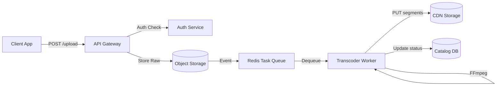
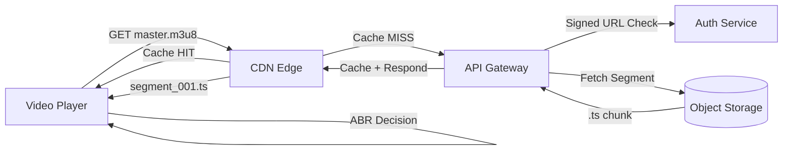
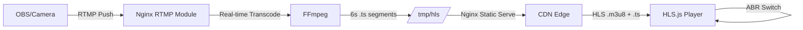

# 🎬 VideoScale: Scaling from 1k to 100M Users

This isn't a collection of streaming projects; it is a **system design artifact** that simulates the engineering journey of a streaming startup — from raw file serving to a globally distributed, DRM-protected, microservices-driven ecosystem.

Every phase documents what broke, what we built to fix it, and what new problems we introduced.

---

## 📊 Quantitative Pressure Model

| Scale | Concurrent Users | Upload RPS | Playback RPS | DB CPU | Transcode Queue | Breaking Symptom |
|---|---|---|---|---|---|---|
| **Prototype** | 10 | 1/s | 10/s | 5% | 0 | Nothing breaks |
| **Launch** | 1,000 | 10/s | 500/s | 25% | 2-3 jobs | TTFB > 800ms on cold starts |
| **Growth** | 10,000 | 50/s | 5,000/s | 65% | 15-20 jobs | Upload latency > 2.8s. Transcoder falls behind |
| **Viral** | 100,000 | 200/s | 50,000/s | 85% | 200+ jobs | DB lock contention. API 502s spike to 3% |
| **Scale** | 1,000,000 | 500/s | 200,000/s | N/A (sharded) | Distributed | Single-region CDN saturates. Latency > 500ms for distant users |
| **Global** | 10,000,000+ | 2,000/s | 1,000,000/s | N/A (multi-region) | Multi-region | Requires geo-routed CDN + edge transcoding |

### What Breaks When (The Pressure Points)

```
At 1,000 users:
  └─► Single server handles it. No issues.

At 10,000 users:
  └─► Upload latency = 2.8s (target: < 500ms)
  └─► Transcoder queue depth = 20 (target: < 5)
  └─► FFmpeg CPU usage = 92% → API starved

At 100,000 users:
  └─► DB CPU = 85% → write latency = 450ms (target: < 50ms)
  └─► 3% of API requests return 502
  └─► CDN cache miss rate = 12% (target: < 5%)
  └─► Estimated monthly cost: $2,300

At 1,000,000 users:
  └─► DB lock contention → catalog writes fail intermittently
  └─► Single-origin bandwidth saturated (10 Gbps NIC maxed)
  └─► CDN egress cost = $23,000/month
  └─► Must shard database and deploy multi-region
```

---

## 🔄 Data Flow Pipelines

### Upload Flow (Ingest)



### Playback Flow (Egress)



### Live Streaming Flow



---

## 🗺️ The Roadmap

### 🧠 Phase 0: The Mental Model
Before code, understand the pipeline: `Capture → Encode → Store → Process → Deliver → Play → Scale`.
- [**Master Principles & Architecture Guide**](docs/principles-and-architecture.md) 📕
- [**Mastering FFmpeg: The Field Manual**](docs/ffmpeg-mastery.md) 🛠️
- [**Streaming Internals: HLS, ABR, & Buffering**](docs/streaming-internals.md) 🎬
- [**System Failure & Resilience Modeling**](docs/failure-modeling.md) 🐜
- [**Operations Runbook: Metrics, Scaling, & Cost**](docs/operations-runbook.md) 🔧

### 🧩 Phase 1: From Scratch (< 1K Users)
- **Project 1:** [Basic Video Streaming Server](projects/01-basic-streaming-server/README.md) - Mastery of `206 Partial Content` and Range Requests.
- **Project 2:** [DIY HLS & Adaptive Bitrate](projects/02-build-your-own-hls/README.md) - Implementing ABR with FFmpeg and HLS.js.

### ⚙️ Phase 2: The Monolith (1K → 10K Users)
- **Project 3:** [Scalable Monolith](projects/03-scalable-backend/README.md) - Automated FastAPI pipeline with background workers and real-time dashboard.
- **Project 4:** [Streaming Optimization](projects/04-streaming-optimization/README.md) - Nginx Edge Caching, Proxying, and HMAC-SHA256 Signed URLs.

### ☁️ Phase 3: Cloud-Native (10K → 100K Users)
- **Project 5:** [Cloud-Native Emulator](projects/05-cloud-native-emulator/README.md) - Simulating AWS S3 (Minio), SQS (Redis), and Lambda (Celery).
- **Project 6:** [Chaos & Resilience](projects/06-chaos-and-resilience/README.md) - Designing for failure with Chaos Monkey (Pumba) and retry logic.

### 🎥 Phase 4: Real-Time & Security (100K → 1M Users)
- **Project 7:** [Real-time Live Streaming](projects/07-live-streaming/README.md) - RTMP ingestion and Live HLS repackaging.
- **Project 8:** [DRM & Content Protection](projects/08-drm-protection/README.md) - AES-128 Encryption and ClearKey License Servers.
- **Project 9:** [Ultra-Low Latency (WebRTC)](projects/09-webrtc-low-latency/README.md) - Real-time communication with <500ms delay.

### 🧱 Phase 5: Service Mesh (1M+ Users)
- **Project 10:** [Microservices Migration](projects/10-microservices-migration/README.md) - Transitioning to a decoupled Service Mesh.

---

## 🏭 Production Readiness Checklist

| Category | Requirement | Status |
|---|---|---|
| **Resilience** | Retry with exponential backoff | ✅ Implemented (Project 6) |
| **Resilience** | Circuit breaker on storage calls | ✅ Implemented (Project 6) |
| **Resilience** | Idempotent transcoding workers | ✅ Implemented (Project 5) |
| **Security** | Rate limiting (per-IP + per-route) | ✅ Implemented (Project 10 Gateway) |
| **Security** | HMAC signed URLs with TTL | ✅ Implemented (Project 4) |
| **Security** | AES-128 segment encryption | ✅ Implemented (Project 8) |
| **Streaming** | HLS segmentation with ABR | ✅ Implemented (Project 2) |
| **Streaming** | Adaptive bitrate switching | ✅ Implemented (HLS.js client) |
| **Streaming** | Sub-second latency (WebRTC) | ✅ Implemented (Project 9) |
| **Ops** | Health check endpoints | ✅ Implemented (all services) |
| **Ops** | Structured logging | 📋 Documented (Runbook) |
| **Ops** | Distributed tracing | 📋 Documented (Runbook) |
| **Ops** | Autoscaling rules | 📋 Documented (Runbook) |
| **Cost** | CDN cache optimization (>95% hit) | 📋 Documented (Runbook) |
| **Cost** | Per-user cost model | 📋 Documented (Runbook) |

---

## 📂 Repository Structure

- `docs/` — Deep dives: streaming internals, failure modeling, operations, FFmpeg
- `projects/` — Hands-on implementations for each scaling phase
- `samples/` — Centralized raw media assets
- `assets/` — Architectural diagrams

---

## 🛠️ Global Tech Stack
- **Languages:** Node.js, Python (FastAPI)
- **Engine:** FFmpeg, HLS.js, Aiortc (WebRTC)
- **Storage:** Local FS, MinIO (S3-compatible)
- **Brokers:** Redis (Queue + Pub/Sub)
- **Infra:** Docker, Nginx (RTMP + Reverse Proxy), Pumba (Chaos)
