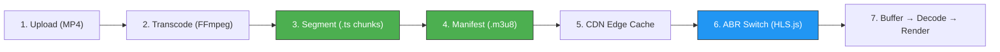
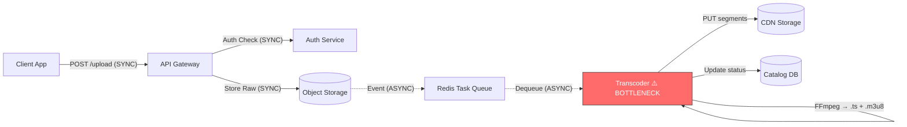
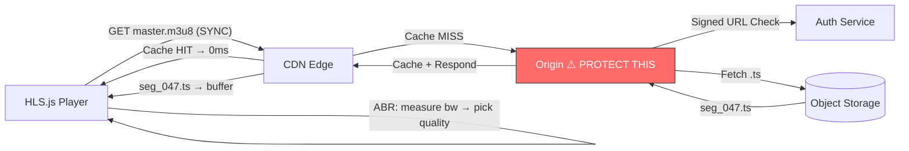

# 🎬 VideoScale: Engineering a Global Streaming Platform

**This is not a backend project that happens to serve video.** This is a **streaming-first system** where every architectural decision — from storage partitioning to circuit breaker thresholds — exists to deliver `.ts` segments to a player buffer within 200ms, at any scale, anywhere in the world.

The system evolves through 5 phases, each triggered by a specific failure at a specific scale. Every phase documents what broke, what we built to fix it, and what new problems we introduced.

---

## 🎬 The Streaming Pipeline (System Spine)

Everything in this repository serves **one goal**: get video segments from storage to the user's screen as fast and reliably as possible. HLS is the backbone.

### How HLS Works (End-to-End)



### Step-by-Step: The Life of a Video

```
1. RAW UPLOAD
   └─► User uploads sample.mp4 (H.264, 1080p, 2GB)
   └─► API returns 202 Accepted immediately (async processing)

2. TRANSCODE (FFmpeg, server-side)
   └─► 4 quality passes: 1080p@5Mbps / 720p@2.8Mbps / 480p@1.4Mbps / 360p@800kbps
   └─► Each pass uses -maxrate and -bufsize for constrained VBR
   └─► Output: 4 streams × ~200 segments each = ~800 .ts files
   └─► Duration: ~8 min on 4-core VM (bottleneck at scale)

3. SEGMENT (.ts chunk lifecycle)
   └─► Each .ts = exactly 6 seconds of muxed H.264 video + AAC audio
   └─► Segment sizes: 360p=0.7MB, 480p=1.1MB, 720p=2.2MB, 1080p=3.8MB
   └─► Naming: /ab/c4/{video_id}/720p/seg_047.ts (hash-prefix for S3 IOPS)
   └─► Lifecycle: HOT (7 days, SSD) → WARM (90 days, IA) → COLD (Glacier)

4. MANIFEST (.m3u8 playlist generation)
   └─► master.m3u8 (Master Playlist):
       │  #EXT-X-STREAM-INF:BANDWIDTH=5000000,RESOLUTION=1920x1080
       │  1080p/playlist.m3u8
       │  #EXT-X-STREAM-INF:BANDWIDTH=2800000,RESOLUTION=1280x720
       │  720p/playlist.m3u8
   └─► 720p/playlist.m3u8 (Media Playlist):
       │  #EXT-X-TARGETDURATION:6
       │  #EXTINF:6.0,
       │  seg_000.ts
       │  #EXTINF:6.0,
       │  seg_001.ts
   └─► For DRM: #EXT-X-KEY:METHOD=AES-128,URI="/api/key/{video_id}"

5. ABR SWITCHING (client-side, HLS.js decision engine)
   └─► Startup: always loads lowest quality first (TTFF < 1.5s)
   └─► Bandwidth estimation: moving average of last 3 segment download speeds
   └─► Upgrade: if measured_bw > 2× next_level.bandwidth → switch up
   └─► Emergency drop: if buffer_seconds < 5 → immediately switch to lowest
   └─► Stability: max 3 quality switches per 60s (prevents flickering)
   └─► Hysteresis: won't downgrade unless bandwidth drops below 1.5× current level

6. PLAYER BUFFER STRATEGY
   └─► VOD: target 30s buffer (absorbs Wi-Fi jitter)
   └─► Live HLS: target 6s buffer (3 segments, minimizes broadcast delay)
   └─► WebRTC: 0s buffer (frame-by-frame, true real-time)
   └─► Rebuffer trigger: buffer < 2s → spinner shown
   └─► Idle pause: buffer > 30s → stop downloading (save bandwidth)

7. DECODE → RENDER
   └─► .ts demuxed → H.264 NALUs + AAC frames
   └─► Hardware decode (GPU) or software decode (CPU fallback)
   └─► Rendered to <video> element at display refresh rate
```

### Segment Request Volume at Scale

| Viewers | Segments/sec | CDN Requests/min | Bandwidth (720p) | .ts files served/hour |
|---|---|---|---|---|
| 1,000 | 167/s | 10K/min | 2.8 Gbps | 600K |
| 100,000 | 16,700/s | 1M/min | 280 Gbps | 60M |
| 1,000,000 | 167,000/s | 10M/min | 2.8 Tbps | 600M |
| 10,000,000 | 1,670,000/s | 100M/min | 28 Tbps | 6B |

---

## 🔄 Data Flow Pipelines

### Upload Flow (Ingest)



### Playback Flow (Egress)



> **Solid lines** = synchronous (user waits). **Dashed lines** = asynchronous (background).

---

## 📊 Quantitative Pressure Model

| Scale | Users | Upload RPS | Playback RPS | DB CPU | Transcode Queue | Breaking Symptom |
|---|---|---|---|---|---|---|
| **Prototype** | 10 | 1/s | 10/s | 5% | 0 | Nothing breaks |
| **Launch** | 1,000 | 10/s | 500/s | 25% | 2-3 jobs | TTFB > 800ms on cold starts |
| **Growth** | 10,000 | 50/s | 5,000/s | 65% | 15-20 jobs | Upload latency > 2.8s |
| **Viral** | 100,000 | 200/s | 50,000/s | 85% | 200+ jobs | DB lock contention. 502s at 3% |
| **Scale** | 1,000,000 | 500/s | 200,000/s | Sharded | Distributed | Single-region CDN saturates |
| **Global** | 10,000,000+ | 2,000/s | 1,000,000/s | Multi-region | Multi-region | Requires geo-routing |

### What Breaks When

```
At 10,000 users:
  └─► Upload latency = 2.8s (target: < 500ms)
  └─► FFmpeg CPU = 92% → API response time degrades to 1.8s
  └─► Transcoder queue depth = 20 → new videos wait 15+ minutes

At 100,000 users:
  └─► DB CPU = 85% → write latency = 450ms (target: < 50ms)
  └─► 3% of API requests return 502 (overload)
  └─► CDN cache miss = 12% → origin under pressure
  └─► Monthly cost: $4,300

At 1,000,000 users:
  └─► DB lock contention → catalog writes fail
  └─► Single-origin 10 Gbps NIC maxed out
  └─► CDN egress = $23,000/month
  └─► Must shard DB + deploy multi-region
```

---

## 📈 Operational Baseline (SLIs / SLOs / Alerting)

### Service Level Objectives

| SLI | SLO Target | P95 | P99 | Alert (PagerDuty) | Measurement |
|---|---|---|---|---|---|
| **Availability** | **99.9%** (8.7h downtime/year) | — | — | < 99.5% over 1h window | Synthetic uptime probe |
| Stream startup | < 2.0s | 1.4s | 2.8s | p95 > 3.0s | Client beacon |
| Rebuffer ratio | < 0.5% | 0.3% | 0.8% | > 1.0% | Client beacon |
| API latency | < 200ms | 120ms | 280ms | p99 > 500ms | Nginx access log |
| Segment fetch (CDN) | < 100ms | 60ms | 150ms | p99 > 300ms | CDN edge log |
| Upload success | > 99.5% | — | — | < 98% | API 2xx ratio |
| CDN cache hit | > 95% | — | — | < 90% | `$upstream_cache_status` |
| Error rate (5xx) | < 0.1% | — | — | > 1.0% | Nginx error log |

### Autoscaling Triggers (Metric → Action)

```
Metric: CPU > 70% sustained 5min
  └─► Action: add API container (min 2, max 10)
  └─► Cooldown: 3 minutes between scale events

Metric: Redis LLEN(transcode_queue) > 20
  └─► Action: add Celery worker (min 1, max 20)
  └─► Alert: if queue > 100 → SEV-2 page

Metric: WebRTC active_sessions > 500/server
  └─► Action: reject new connections with 503
  └─► Alert: if all servers > 80% → SEV-3

Metric: CDN miss_rate > 10%
  └─► Action: pre-warm cache for top 100 trending videos
  └─► Runbook: check if new content was published without cache hint

Metric: p99_latency > 500ms sustained 3min
  └─► Action: enable load shedding (drop 10% of lowest-priority requests)
  └─► Alert: SEV-2 page
```

### Reliability Patterns

| Pattern | Where | Behavior |
|---|---|---|
| Exponential backoff | Worker → S3 | 0s → 2s → 4s → 8s → Dead Letter Queue |
| Circuit breaker | Worker → MinIO | Open after 5 failures/60s. Probe every 30s |
| Idempotent workers | Celery tasks | `IF EXISTS output → skip` (no duplicate .ts files) |
| Rate limiting | Nginx gateway | 50 req/s per IP, 5 uploads/min per user |
| Request collapsing | Nginx proxy_cache | `proxy_cache_lock on` (1 origin fetch per segment) |
| Graceful degradation | DRM key server | If key vault down → serve 480p unencrypted |

---

## 💰 Cost at Scale

### Monthly Infrastructure Cost

| Scale | Compute | Storage | CDN Egress | Transcode | Total/month | Per-User |
|---|---|---|---|---|---|---|
| 1K | $50 | $12 | $30 | $10 | **$102** | $0.102 |
| 10K | $200 | $120 | $300 | $80 | **$700** | $0.070 |
| 100K | $800 | $500 | $3,000 | $400 | **$4,700** | $0.047 |
| 1M | $5,000 | $2,500 | $23,000 | $3,000 | **$33,500** | $0.034 |
| 10M | $30,000 | $15,000 | $180,000 | $20,000 | **$245,000** | $0.025 |

### Cost Breakdown & Optimization

```
WHERE THE MONEY GOES (at 100K users):
  CDN Egress:     64%  ← #1 COST DRIVER (every .ts served = bandwidth bill)
  Compute:        17%  (API servers + transcoder workers)
  Storage:        11%  (4 quality levels × all videos × 3 tiers)
  Transcoding:     8%  (FFmpeg CPU hours — grows linearly with uploads)

TRANSCODING COST EXPLOSION:
  At 1K uploads/day × 8 min transcode each = 133 CPU-hours/day
  At 10K uploads/day = 1,333 CPU-hours/day = $1,200/day on-demand
  At 10K uploads/day + spot instances = $360/day (70% savings)

STORAGE TIERING (applied in Project 5):
  HOT  (S3 Standard, SSD):   last 7 days     → $0.023/GB/month
  WARM (S3 IA, HDD):         8-90 days       → $0.0125/GB/month
  COLD (S3 Glacier):         >90 days        → $0.004/GB/month
  At 52TB total: all-hot = $1,196/mo → tiered = $484/mo (60% savings)

MULTI-REGION REPLICATION COST:
  Cross-region copy: $0.02/GB
  Replicating 10TB trending content to 3 regions = $600/month
  BUT: reduces p99 latency from 400ms → 80ms for 70% of global users
```

---

## 🌍 Extreme Scale: 100M Users (The Netflix Problem)

At **100 million monthly active users** with **10 million concurrent streams**, the system faces challenges that no single architecture can solve:

```
THE NUMBERS:
  Concurrent streams:         10,000,000
  Segments/sec globally:      1,670,000/s
  CDN bandwidth:              28 Tbps (sustained)
  CDN egress/month:           ~$1.8M
  Storage (all qualities):    500+ PB
  Transcode capacity needed:  50,000+ CPU-cores

THE PROBLEMS:
  1. Single-CDN failure → 10M users lose playback simultaneously
  2. US-East S3 outage → all origin fetches fail globally
  3. Submarine cable cut → 2M Asian users experience 3s+ latency
  4. Viral event (World Cup) → 50M concurrent (5× normal peak)
```

### Solutions at 100M Scale

| Problem | Solution | Implementation |
|---|---|---|
| CDN single point of failure | **Multi-CDN strategy** | Route via Cloudflare primary, Akamai failover. DNS-level health checks switch in <30s |
| Regional S3 outage | **Cross-region replication** | S3 CRR to 3 regions. Read replica promotion in <60s |
| Geographic latency | **Geo-routing** | Route53/Cloudflare geo-DNS sends users to nearest edge. Latency-based routing |
| Viral traffic spike | **Edge transcoding** | Pre-position popular content at edge. Transcode at edge for <1s startup |
| Cost explosion | **Reserved capacity** | 3-year reserved instances for baseline. Spot for burst. Negotiate CDN commits |
| Regional outage | **Failover regions** | Active-active in 3 regions. If us-east-1 fails, eu-west-1 absorbs traffic in <60s |

```
MULTI-CDN ROUTING LOGIC:
  1. User requests master.m3u8
  2. DNS resolver checks user's geographic location
  3. Route to nearest healthy CDN PoP:
     ├─► NA users  → Cloudflare (primary) / Akamai (failover)
     ├─► EU users  → Akamai (primary) / CloudFront (failover)
     └─► APAC users → CloudFront (primary) / Cloudflare (failover)
  4. If primary CDN health check fails (3 consecutive 5xx):
     └─► DNS TTL = 30s → failover CDN receives traffic within 60s
  5. Origin-shield: each CDN region has ONE designated origin-fetch node
     └─► Prevents thundering herd on S3 during CDN failover
```

---

## 🗺️ The Roadmap

### 🧠 Phase 0: The Mental Model
Before code, understand the pipeline: `Capture → Encode → Store → Process → Deliver → Play → Scale`.
- [**Master Principles & Architecture Guide**](docs/principles-and-architecture.md) 📕
- [**Mastering FFmpeg: The Field Manual**](docs/ffmpeg-mastery.md) 🛠️
- [**Streaming Internals: HLS, ABR, & Buffering**](docs/streaming-internals.md) 🎬
- [**System Failure & Resilience Modeling**](docs/failure-modeling.md) 🐜
- [**Operations Runbook: Metrics, Scaling, & Cost**](docs/operations-runbook.md) 🔧

### 🧩 Phase 1: From Scratch (< 1K Users)
- **Project 1:** [Basic Video Streaming Server](projects/01-basic-streaming-server/README.md) — `206 Partial Content`, Range Requests, byte-level streaming.
- **Project 2:** [DIY HLS & Adaptive Bitrate](projects/02-build-your-own-hls/README.md) — `.ts` segmentation, `.m3u8` manifests, ABR with HLS.js.

### ⚙️ Phase 2: The Monolith (1K → 10K Users)
- **Project 3:** [Scalable Monolith](projects/03-scalable-backend/README.md) — Async transcoding pipeline, background workers, real-time status dashboard.
- **Project 4:** [Streaming Optimization](projects/04-streaming-optimization/README.md) — Nginx edge caching, `proxy_cache_lock`, HMAC signed URLs.

### ☁️ Phase 3: Cloud-Native (10K → 100K Users)
- **Project 5:** [Cloud-Native Emulator](projects/05-cloud-native-emulator/README.md) — S3 (MinIO), task queues (Redis/Celery), storage tiering.
- **Project 6:** [Chaos & Resilience](projects/06-chaos-and-resilience/README.md) — Circuit breakers, retry storms, idempotent workers, Pumba chaos testing.

### 🎥 Phase 4: Real-Time & Security (100K → 1M Users)
- **Project 7:** [Real-time Live Streaming](projects/07-live-streaming/README.md) — RTMP ingestion, live `.ts` generation, glass-to-glass latency.
- **Project 8:** [DRM & Content Protection](projects/08-drm-protection/README.md) — AES-128 segment encryption, key rotation, ClearKey license server.
- **Project 9:** [Ultra-Low Latency (WebRTC)](projects/09-webrtc-low-latency/README.md) — Sub-500ms P2P streaming, SDP negotiation, stateful scaling wall.

### 🧱 Phase 5: Service Mesh (1M+ Users)
- **Project 10:** [Microservices Migration](projects/10-microservices-migration/README.md) — Service isolation, API gateway, rate limiting, distributed tracing challenges.

---

## 🏭 Production Readiness Checklist

| Category | Requirement | Status |
|---|---|---|
| **Streaming** | HLS segmentation (.ts + .m3u8) with 4-level ABR | ✅ Implemented (Project 2) |
| **Streaming** | Client-side ABR switching (HLS.js) | ✅ Implemented (Project 2) |
| **Streaming** | Live RTMP-to-HLS repackaging | ✅ Implemented (Project 7) |
| **Streaming** | Sub-500ms WebRTC delivery | ✅ Implemented (Project 9) |
| **Streaming** | AES-128 encrypted segments | ✅ Implemented (Project 8) |
| **Resilience** | Exponential backoff + DLQ | ✅ Implemented (Project 6) |
| **Resilience** | Circuit breaker on storage | ✅ Implemented (Project 6) |
| **Resilience** | Idempotent transcoding | ✅ Implemented (Project 5) |
| **Security** | Rate limiting (per-IP + per-route) | ✅ Implemented (Project 10) |
| **Security** | HMAC signed URLs with TTL | ✅ Implemented (Project 4) |
| **Ops** | Health check endpoints | ✅ Implemented (all services) |
| **Ops** | SLO targets defined (99.9%) | 📋 Documented |
| **Ops** | Autoscaling triggers defined | 📋 Documented |
| **Cost** | Storage tiering (hot/warm/cold) | 📋 Documented |
| **Cost** | Multi-CDN failover strategy | 📋 Documented |

---

## 📂 Repository Structure

- `docs/` — Deep dives: streaming internals, failure modeling, operations, FFmpeg
- `projects/` — Hands-on implementations for each scaling phase
- `samples/` — Centralized raw media assets

---

## 🛠️ Tech Stack
- **Streaming:** FFmpeg, HLS.js, Nginx-RTMP, Aiortc (WebRTC)
- **Backend:** Node.js, Python (FastAPI), Celery
- **Storage:** Local FS, MinIO (S3-compatible), Redis
- **Infra:** Docker, Nginx (reverse proxy + edge cache), Pumba (chaos)
