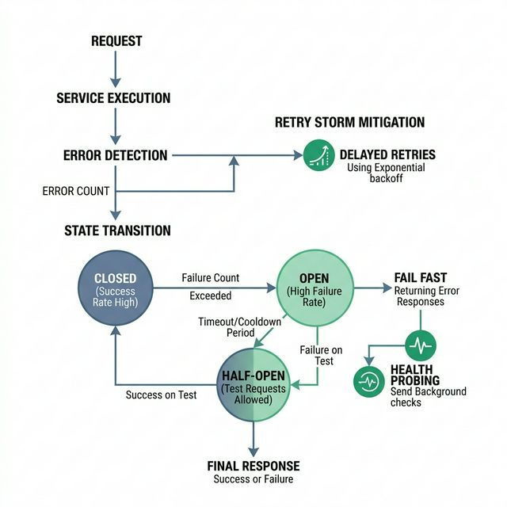

# 🐜 System Failure Modeling & Mitigation

**Failure is not an edge case. It is the default state of distributed systems.** This document defines explicit failure scenarios, their measurable triggers, and the engineering patterns that prevent cascading outages.

---

## Failure Scenario Matrix

| # | Failure | Trigger | Blast Radius | Mitigation Pattern | Recovery Time |
|---|---|---|---|---|---|
| F1 | Upload Interrupted | Client disconnects mid-upload | Single user, orphaned bytes in storage | Resumable Upload (tus protocol) | Instant (client resumes) |
| F2 | Transcoder OOM Kill | Video > 4GB + 4K resolution | Single job stalls, queue backs up | Lease Pattern + Dead Letter Queue | < 30 seconds (auto-retry) |
| F3 | CDN Cache Miss Storm | New viral video, 0% cache warmth | Origin receives 100% of traffic | Request Collapsing + Stale-While-Revalidate | < 5 seconds (cache populates) |
| F4 | S3/MinIO Timeout | Storage node restart or network partition | All uploads and playback fail | Circuit Breaker + Local Fallback Cache | < 10 seconds (breaker opens) |
| F5 | Auth Service Crash | Memory leak after 48h uptime | No new logins, existing sessions unaffected | Stateless JWT + Health Check Auto-Restart | < 3 seconds (container restart) |
| F6 | DRM Key Server Down | DDoS or dependency failure | All DRM-protected playback fails | Edge Key Cache (TTL 5min) + Graceful Degradation | < 5 minutes (manual intervention) |
| F7 | Database Lock Contention | > 5,000 concurrent writes to catalog | Write latency > 2s, reads unaffected | Read Replicas + Write Queue Batching | ~ 30 seconds (queue drains) |
| F8 | WebRTC Session Overload | > 800 concurrent sessions per server | CPU 100%, all streams artifact | Connection Admission Control (reject at 800) | Instant (new users get 503) |

---

## Detailed Failure Playbooks

### F1: Upload Interrupted → Resumable Upload

```
SCENARIO:
  User uploads a 2GB file over mobile 4G.
  At 1.4GB transferred, the user enters a tunnel. Connection drops.

WITHOUT MITIGATION:
  1.4GB of uploaded data is wasted.
  User must restart from byte 0.
  Server has a 1.4GB orphan file consuming storage.

WITH MITIGATION (tus protocol):
  Upload is split into 5MB chunks with server-side offset tracking.
  On reconnect, client sends HEAD request → server responds "offset: 1,400,000,000"
  Client resumes from byte 1.4GB.
  Orphan cleanup: cron job deletes incomplete uploads older than 24h.
```

### F2: Transcoder Crash → Retry Queue with Exponential Backoff

```
SCENARIO:
  FFmpeg process is killed by OOM (video requires 8GB RAM, container limit is 4GB).

WITHOUT MITIGATION:
  Video status stuck on "PROCESSING" forever.
  User sees infinite spinner. Support ticket created.

WITH MITIGATION:
  1. Worker holds a Redis lock with TTL = 300s
  2. Worker dies → lock expires after 300s
  3. Retry consumer picks up the job
  4. Attempt 2: retry with lower quality preset (-preset fast, -crf 28)
  5. Attempt 3: retry with resolution cap (max 720p)
  6. Attempt 4 (final): move to Dead Letter Queue for manual review
  
  Backoff schedule: 0s → 30s → 120s → 300s
  Max retry count: 3
  Alert: PagerDuty fires after job hits Dead Letter Queue
```

### F3: CDN Cache Miss → Request Collapsing

```
SCENARIO:
  A video goes viral. 500,000 users request segment_001.ts simultaneously.
  CDN has 0% cache for this video.

WITHOUT MITIGATION:
  500,000 requests hit origin FastAPI server.
  At 100 RPS capacity, server crashes in < 0.5 seconds.

WITH MITIGATION (Nginx proxy_cache_lock):
  1. First request (User #1) → Cache MISS → forwarded to origin
  2. Requests 2-500,000 → Nginx holds them (proxy_cache_lock on)
  3. Origin responds to User #1 → Nginx caches the segment
  4. Nginx serves cached segment to remaining 499,999 users
  
  Origin load: 1 request (instead of 500,000)
  User #1 latency: ~200ms (origin fetch)
  Users #2-500K latency: ~210ms (wait for cache + serve)

  Nginx config:
    proxy_cache_lock on;
    proxy_cache_lock_timeout 5s;
    proxy_cache_use_stale updating;
```

### F4: Storage Failure → Circuit Breaker Pattern

```
SCENARIO:
  MinIO (S3) node restarts during a rolling update.
  For 10 seconds, all S3 PUTs return 503.

WITHOUT MITIGATION:
  All 200 active transcoder workers retry aggressively.
  200 workers × 10 retries/sec = 2,000 requests/sec hitting a dead endpoint.
  Network saturates. Even after S3 recovers, the retry storm keeps it down.

WITH MITIGATION (Circuit Breaker - 3 states):
  CLOSED (normal):
    └─► Requests flow to S3 normally
    └─► Track failure count in sliding window (last 60s)
  
  OPEN (tripped, after 5 failures in 60s):
    └─► All S3 requests immediately return "SERVICE_UNAVAILABLE"
    └─► No network calls made. Zero load on S3.
    └─► Workers write to local disk as fallback
    └─► Timer: 30 seconds
  
    └─► Allow 1 probe request to S3
    └─► If success → move to CLOSED
    └─► If failure → move back to OPEN for another 30s


```

### F5: Service Crash → Stateless Recovery

```
SCENARIO:
  Auth service container crashes due to unhandled exception.

WITHOUT MITIGATION (Stateful sessions):
  All 10,000 active user sessions are lost.
  Every user is logged out and must re-authenticate.

WITH MITIGATION (Stateless JWT):
  Auth service restarts in 3 seconds (Docker restart policy).
  Existing JWT tokens remain valid (verified by signature, not server state).
  Users experience 0 disruption — their tokens work on ANY Auth instance.
  Only users actively logging in during the 3s window see an error.
```

---

## Chaos Testing Checklist

Run these tests monthly to validate resilience:

```bash
# F2: Kill a transcoder mid-job
docker kill --signal=SIGKILL $(docker ps -q -f name=worker)

# F3: Simulate cache miss storm
ab -n 100000 -c 1000 http://localhost:8084/stream/segment_001.ts

# F4: Stop storage for 10 seconds
docker pause minio && sleep 10 && docker unpause minio

# F5: Kill auth service during active sessions
docker stop auth-service && sleep 5 && docker start auth-service

# F8: Overload WebRTC server
for i in $(seq 1 1000); do curl -X POST http://localhost:8089/offer & done
```

---

[Back to Roadmap](../README.md) | [Operations Runbook](operations-runbook.md) | [Streaming Internals](streaming-internals.md)
