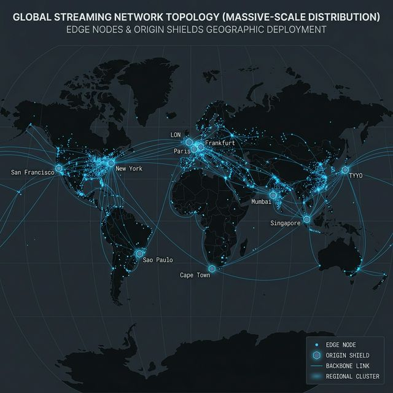
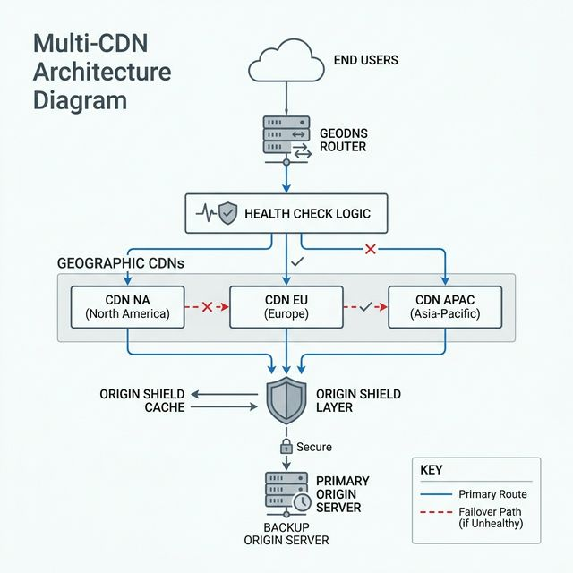

# 🌍 Hyperscale: The 100M User Architecture

This document describes what happens when your streaming platform reaches **100 million monthly active users** with **10 million concurrent streams**. At this scale, every assumption from earlier phases breaks.

---

## The Numbers

```
TRAFFIC:
  Monthly active users:       100,000,000
  Peak concurrent streams:    10,000,000
  Segments requested/sec:     1,670,000/s (6s chunks)
  CDN bandwidth (sustained):  28 Tbps
  CDN bandwidth (World Cup):  140 Tbps (5× burst)

STORAGE:
  Total library:              500+ PB
  New uploads/day:            500,000 videos
  Daily transcode CPU-hours:  266,000+ hours

COST:
  CDN egress/month:           ~$1.8M
  Compute/month:              ~$300K
  Storage/month:              ~$150K
  Total infrastructure:       ~$2.5M/month
```



---

## What Breaks at 100M

### 1. Single-CDN Failure

```
SCENARIO: Cloudflare has a 15-minute global outage.
IMPACT:   10M concurrent users lose playback simultaneously.
DURATION: Even after CDN recovers, cache is cold → origin stampede.

WHY THIS MATTERS:
  At 10M concurrent, a CDN outage costs:
  - 10M × 15 min × $0.01/min avg revenue = $1.5M revenue loss
  - Customer trust: unmeasurable but potentially fatal
```

### 2. Regional Origin Outage

```
SCENARIO: AWS us-east-1 has an S3 availability event (2-hour degradation).
IMPACT:   All origin fetches for NA users fail. CDN serves stale cache for ~1 hour.
          After cache expires, playback fails for all content not pre-warmed.

WHY THIS MATTERS:
  S3 serves as the "single source of truth."
  Without cross-region replication, a regional outage = global impact.
```

### 3. Submarine Cable Disruption

```
SCENARIO: Cable cut between US and Asia-Pacific.
IMPACT:   2M APAC users experience 3-5 second segment fetch latency.
          HLS player starts rebuffering (buffer drains faster than it fills).
          Effective rebuffer ratio: 15% (target: <0.5%).

WHY THIS MATTERS:
  Even with CDN PoPs in Asia, if origin is in US and cache misses occur,
  the cross-Pacific roundtrip adds 200-400ms per segment fetch.
```

### 4. Viral Burst (World Cup Final)

```
SCENARIO: 50M concurrent viewers (5× normal peak) tune in within 10 minutes.
IMPACT:   CDN edge caches are cold for the live stream.
          Origin receives 8.3M segment requests/sec (normally handles 200K/s).
          Origin crashes in <30 seconds.

WHY THIS MATTERS:
  Live events don't have pre-cached content.
  The first segment of a live stream is ALWAYS a cache miss.
```

---

## Solutions at 100M Scale

### Multi-CDN Strategy



**Routing Logic:**

| User Region | Primary CDN | Failover CDN | Switch Trigger | Switch Time |
|---|---|---|---|---|
| North America | Cloudflare | Akamai | 3× 5xx in 30s | < 60s (DNS TTL) |
| Europe | Akamai | CloudFront | 3× 5xx in 30s | < 60s |
| Asia-Pacific | CloudFront | Cloudflare | 3× 5xx in 30s | < 60s |
| South America | Cloudflare | Akamai | 3× 5xx in 30s | < 60s |

**CDN Health Check:**
```
Every 10 seconds per CDN PoP:
  1. Synthetic fetch: GET /healthcheck/segment_probe.ts
  2. Measure: response_time, status_code, content_hash
  3. If status != 200 OR response_time > 2s → mark DEGRADED
  4. If 3 consecutive DEGRADED → trigger DNS failover
  5. If failover CDN also DEGRADED → enable origin-shield mode
```

### Geo-Routing Architecture

```
USER REQUEST → GeoDNS (latency-based routing)
                │
                ├── NA user → us-east-1 origin → Cloudflare NA PoPs
                │                └── failover: us-west-2 replica
                │
                ├── EU user → eu-west-1 origin → Akamai EU PoPs
                │                └── failover: eu-central-1 replica
                │
                └── APAC user → ap-southeast-1 origin → CloudFront APAC PoPs
                                 └── failover: ap-northeast-1 replica

Each region has:
  - Independent S3 bucket (CRR-replicated, <15min lag)
  - Independent API cluster (2-10 instances, auto-scaled)
  - Independent Redis broker (for transcode queue)
  - Shared: user database (global Aurora, write in us-east-1, read replicas in all)
```

### Origin-Shield (Thundering Herd Prevention)

```
PROBLEM: During CDN failover, new CDN has empty cache.
         10M users × cache miss = 10M requests to origin in 30 seconds.

SOLUTION: Origin-Shield Layer

  CDN Edge PoP → Shield Node (1 per region) → Origin S3
                      │
                  Only 1 request per segment reaches origin.
                  All other requests queue behind shield.
                  Shield caches response, serves to all queued requests.

IMPLEMENTATION:
  proxy_cache_lock on;              # Only 1 origin fetch per key
  proxy_cache_lock_timeout 10s;     # Wait up to 10s for origin
  proxy_cache_use_stale updating;   # Serve stale if origin is slow
  proxy_cache_valid 200 1h;         # Cache hits for 1 hour
```

### Failover Regions

```
ACTIVE-ACTIVE DEPLOYMENT:

  ┌──────────────┐  ┌──────────────┐  ┌──────────────┐
  │  us-east-1   │  │  eu-west-1   │  │ ap-south-1   │
  │  PRIMARY     │  │  REPLICA     │  │  REPLICA      │
  │              │  │              │  │              │
  │  API ×5      │  │  API ×3      │  │  API ×3      │
  │  Workers ×10 │  │  Workers ×5  │  │  Workers ×5  │
  │  S3 (master) │──│  S3 (CRR)   │──│  S3 (CRR)   │
  │  Aurora (w)  │──│  Aurora (r)  │──│  Aurora (r)  │
  │  Redis       │  │  Redis       │  │  Redis       │
  └──────────────┘  └──────────────┘  └──────────────┘

FAILOVER SCENARIO: us-east-1 goes down
  1. Health probe detects failure (30s)
  2. DNS failover routes NA traffic to eu-west-1 (60s)
  3. eu-west-1 Aurora read-replica promoted to writer (120s)
  4. eu-west-1 auto-scales API 3→8, Workers 5→15 (180s)
  5. Total failover time: ~5 minutes
  6. Data loss: last 15 minutes of S3 CRR lag (uploads may need re-process)
```

---

## Consistency at Hyperscale

At global scale, you cannot have both perfect consistency and perfect availability (CAP theorem in practice):

| Component | Consistency Model | Why |
|---|---|---|
| User Auth (JWT) | **Eventually Consistent** | Tokens valid for 24h. Revocation propagates via pub/sub (5s lag) |
| Video Catalog | **Eventually Consistent** | Reads from local replica. Write to primary, replicate in <1s |
| Transcode Status | **Strong within region** | Redis per-region. No cross-region sync needed |
| Billing/Revenue | **Strong Consistency** | Always reads from primary Aurora. Worth the latency cost |
| CDN Cache | **Stale-While-Revalidate** | Serve cached content, update in background. Max staleness: 1h |
| S3 Cross-Region Copy | **Eventually Consistent** | CRR lag: 5-15 minutes. Acceptable for VOD (live uses same-region) |

---

## Load Growth Curve

```
Year 1:   1K → 10K users (organic growth, single server)
Year 2:   10K → 100K users (marketing push, must add CDN + workers)
Year 3:   100K → 1M users (viral content, must shard DB + multi-region storage)
Year 4:   1M → 10M users (international expansion, multi-CDN required)
Year 5:   10M → 100M users (market leader, edge transcoding + multi-region active-active)

SCALING RULE OF THUMB:
  Every 10× growth requires a fundamental architecture change.
  You cannot "just add servers" past the 10× boundary.
```

---

[Back to Roadmap](../README.md) | [Cost Architecture](cost-architecture.md) | [Operations Runbook](operations-runbook.md)
