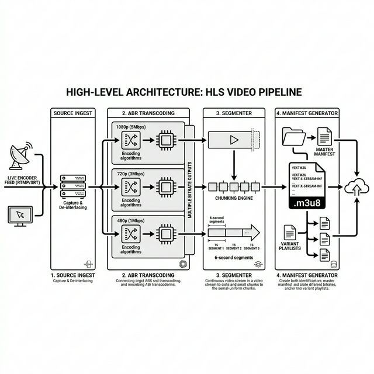

# 🏛️ VideoScale: Master Principles & Architecture

This document serves as the theoretical foundation for the VideoScale platform. It explains the "Why" behind the "How."

👉 **Looking for specific commands? Check the [Mastering FFmpeg Guide](ffmpeg-mastery.md)** 🛠️
👉 **Deep-dive into HLS/ABR? Read the [Streaming Internals](streaming-internals.md)** 🎬
👉 **How failures are handled? Read the [Failure Modeling Guide](failure-modeling.md)** 🐜
👉 **How we operate at scale? Read the [Operations Runbook](operations-runbook.md)** 🔧

---

## 🧩 Phase 1: The Foundation
### 1. HTTP Range Requests (Project 1)
- **Concept:** Instead of downloading a whole 1GB file, the browser asks for bytes 0-1024.
- **Why:** This allows "scrubbing" (jumping to the middle of a video) instantly without waiting for the whole file. It saves bandwidth and improves UX.
- **Tech:** `206 Partial Content` status code.

### 2. Adaptive Bitrate (ABR) & HLS (Project 2)
- **Concept:** Breaking video into 10-second "chunks" at different qualities (480p, 720p, 1080p).
- **Why:** Users on slow 3G shouldn't buffer; they should get 480p. If they move to Wi-Fi, the player automatically switches to 1080p.
- **Tech:** `.m3u8` manifests act as the "instruction manual" for the player.

---

## ⚙️ Phase 2: System Scale
### 3. Asynchronous Transcoding (Project 3)
- **Concept:** Moving heavy FFmpeg tasks to background workers.
- **Why:** If you transcode in the main web thread, the whole website "freezes" for every other user.
- **Tech:** Python `BackgroundTasks` or Celery.

### 4. Edge Caching & Security (Project 4)
- **Concept:** Putting a "Librarian" (Nginx) in front of the "Author" (Backend).
- **Why:** 10,000 users watching the same video shouldn't hit your database. Nginx stores the chunks at the "Edge."
- **HMAC Tokens:** Cryptographic signatures that ensure only paying users can get the "Librarian" to give them a book.

---

## ☁️ Phase 3: Cloud Native
### 5. Distributed Storage (Project 5)
- **Concept:** Moving from "Local Disks" to "Object Storage" (S3).
- **Why:** Hard drives fill up and die. S3 (MinIO) scales infinitely.
- **Event-Driven:** When a file lands in S3, the system "wakes up" a worker to process it.

### 6. Chaos Engineering (Project 6)
- **Concept:** "Designing for Failure."
- **Why:** In the cloud, networks lag and machines restart. We use **Pumba** to break things and **Tenacity** (Exponential Backoff) to heal them.

---

## 🎥 Phase 4: Real-Time
### 7. RTMP Ingestion (Project 7)
- **Concept:** Low-latency push vs. pull.
- **Why:** Live video requires a continuous feed. **RTMP** is optimized for high-speed delivery from the camera to the server.
- **Real-Time Repackaging:** The server converts RTMP into HLS on-the-fly (muxing) so browsers can play it.

---

## 🚀 The Global Outcome
By completing this roadmap, you have evolved from a **Web Developer** to a **Systems Engineer capable of building Netflix-scale infrastructure.**
