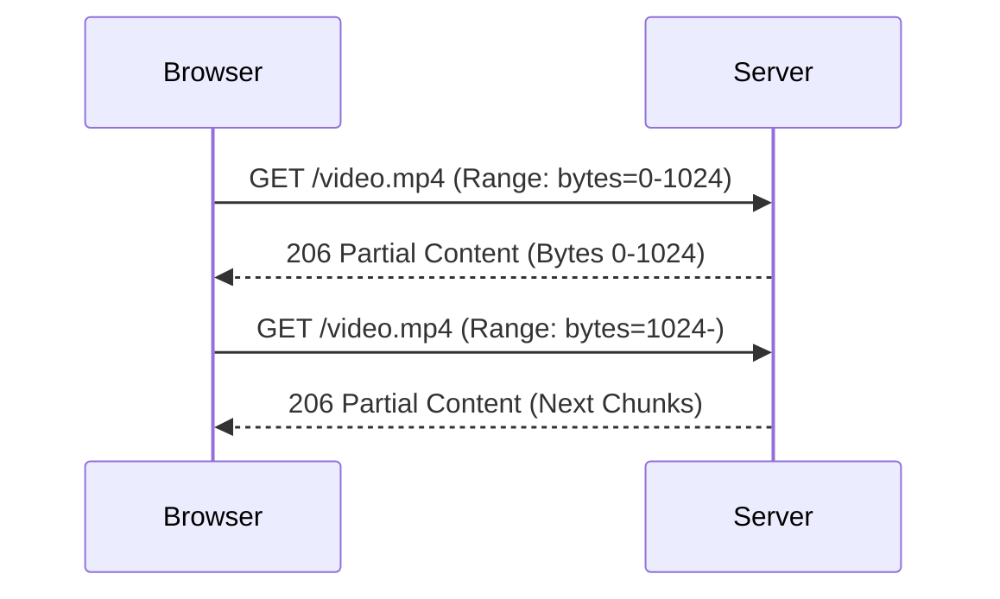

# Project 1: Basic Video Streaming Server

## 🚀 The Goal
Understand the "Magic" of the `206 Partial Content` status code and how browsers request specific byte ranges.

## 😰 The Problem
If you serve a 2GB video file via a standard `GET` request:
- Browser must download **~200MB** before it can begin playback (TTFB > 8 seconds on 200Mbps)
- Seeking to the middle requires downloading **1GB** first
- If a user only watches 30 seconds of a 2-hour movie, you've wasted **1.97GB of bandwidth** (98.5% waste)
- At 1,000 concurrent users: **1.97TB wasted bandwidth per session**

## 💡 The Solution: HTTP Range Requests
The server detects a `Range` header and streams only the requested bytes.



## 😰 The Breaking Point
At **100+ concurrent users**, a single Node.js server becomes I/O bound:
- `fs.createReadStream` opens 100 file descriptors simultaneously
- Disk throughput maxes at ~500 MB/s (HDD) or ~3 GB/s (SSD)
- At 100 users × 5 Mbps each = **500 Mbps sustained** → saturates a standard NIC
- **No caching**: Every seek creates a new read stream from disk

## 📊 Performance Baseline
| Metric | Value |
|---|---|
| TTFB (first byte) | < 50ms (local SSD) |
| Seek latency | 80-200ms (depending on file position) |
| Max concurrent streams | ~100 (limited by disk I/O) |
| Bandwidth per user | 3-8 Mbps (depending on quality) |

---

## 🚀 How to Run

### What we are building:
A Node.js server that can:
1. Detect `Range` headers from the browser.
2. Calculate the start and end bytes.
3. Stream only that chunk using `fs.createReadStream`.

---

## 🛠️ Architecture
- **Language:** JavaScript (Node.js)
- **Library:** Express (or built-in `http` module for "hard mode")
- **Storage:** Local `videos/` folder

---

## 🧪 Key Learnings
1. **Status Code 206:** What "Partial Content" means.
2. **Content-Range Header:** How to tell the browser "Here is bytes 500-1000 of 9000".
3. **Buffering:** How the browser decides how much to pre-fetch.

---

## 🚀 Getting Started

### 1. Preparation
Place an MP4 file named `sample1.mp4` in the root `samples/` directory of the repository.

### 2. Install & Start
```bash
npm install
npm start
```

### 3. Access on Desktop
Open `http://localhost:3000` in your browser.

### 4. Access on Mobile (Phone/Tablet)
To test the "Real World" experience on a mobile device:
1. Ensure your phone and computer are on the **same Wi-Fi**.
2. Find your computer's **Local IP address**.
3. Open the browser on your phone and go to: `http://<YOUR_LOCAL_IP>:3000`
   *(Example: http://192.168.1.5:3000)*
4. Experiment with seeking and notice how the browser handles buffering differently on mobile networks.

[Back to Roadmap](../../README.md)
