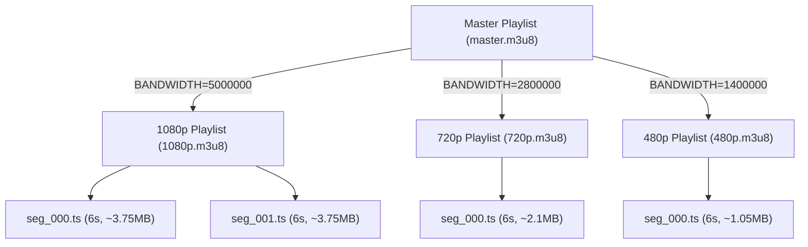

# Project 2: DIY HLS & Adaptive Bitrate (ABR)

## 🚀 The Goal
Build a streaming experience that works on any device and any network speed, just like YouTube.

## 😰 The Problem
In Project 1 (Range Requests), we served a single file. If the user is on a slow 3G connection, the 1080p video will buffer forever. If we serve only 480p, Wi-Fi users will be disappointed.

## 💡 The Solution: HLS (HTTP Live Streaming)
Instead of serving one big file, we use FFmpeg to chop the video into small **6-second `.ts` segments**.



### ABR Bitrate Ladder

| Level | Resolution | Video Bitrate | Audio | Segment Size (6s) | Min Bandwidth Required |
|---|---|---|---|---|---|
| 0 | 360p | 800 kbps | 128k AAC | ~0.7 MB | 1.0 Mbps |
| 1 | 480p | 1,400 kbps | 128k AAC | ~1.1 MB | 1.8 Mbps |
| 2 | 720p | 2,800 kbps | 128k AAC | ~2.2 MB | 3.5 Mbps |
| 3 | 1080p | 5,000 kbps | 128k AAC | ~3.8 MB | 6.5 Mbps |

### Client-Side ABR Behavior (HLS.js)
1. **Startup:** Player always starts at Level 0 (360p) to minimize Time-to-First-Frame
2. **Ramp-up:** After 3 segments, estimates bandwidth from download speed
3. **Switching:** If measured bandwidth > 2× current level's requirement → upgrade
4. **Drop:** If buffer < 5 seconds → immediately drop to lowest sustainable quality
5. **Stability:** Max 3 quality switches per 60 seconds to prevent "flickering"

## 🛠️ Implementation Idea
1. **Transcoding:** We use FFmpeg to create multiple versions of the video (e.g., 480p, 720p).
2. **Segmentation:** We chop those versions into small pieces.
3. **Manifesting:** We create a Master Playlist that links everything together.

## 😰 The Breaking Point
At **10,000+ users**, the CPU cost of transcoding becomes the dominant expense:

```
Per video (2GB, 1080p input):
  └─► Transcode to 4 qualities: ~8 minutes on 4-core VM
  └─► Storage: 2GB raw + 3.2GB encoded (4 qualities) = 5.2GB total
  └─► Storage cost at 10K videos: 52TB × $0.023/GB = $1,196/month

At 1,000 concurrent uploads:
  └─► Transcode queue: 1,000 jobs ÷ 4 concurrent = 250 minutes wait
  └─► CPU: 100% sustained for 4+ hours
  └─► User experience: "Your video will be ready in 4 hours"
```

## ⚖️ Architecture Trade-offs
- **Pro:** Perfect User Experience. The player automatically switches quality, ensuring no buffering.
- **Con (Storage Explosion):** 4 quality levels = ~2.5× the original file size. At scale, storage costs dominate.
- **Con (Segment Request Volume):** A 2-hour movie at 6s segments = 1,200 HTTP requests per quality level per viewer.

## 🎬 Role in the Streaming Pipeline

```
THIS PROJECT:  [2. HLS ENGINE — THE CORE]
                    │
Upload → ──► TRANSCODE → SEGMENT (.ts) → MANIFEST (.m3u8) → CDN → ABR → Play
              ^^^^^^^^^^^^^^^^^^^^^^^^^^^^^^^^^^^^^^^^^^^^
              You are here. This is the HEART of the system.

Every project after this depends on what we build here:
  Project 3: Automates this transcode pipeline
  Project 4: Caches these .ts segments at the edge
  Project 5: Stores these segments in S3
  Project 7: Generates these segments in real-time (live)
  Project 8: Encrypts these segments with AES-128
```

---

**Read Next:** [Project 3: Scalable Monolith](../03-scalable-backend/README.md) — Automate this pipeline | [Streaming Internals Deep-Dive](../../docs/streaming-internals.md) | [Back to Roadmap](../../README.md)
