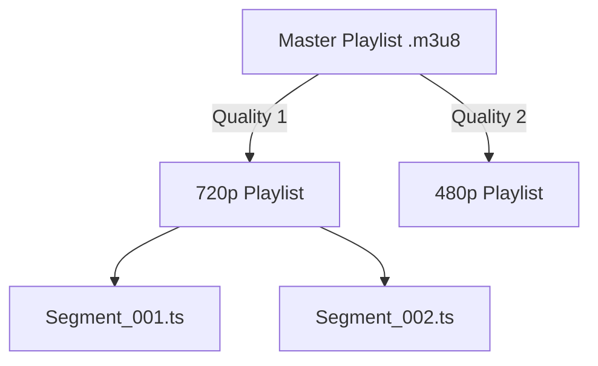

# Project 2: DIY HLS & Adaptive Bitrate (ABR)

## 🚀 The Goal
Build a streaming experience that works on any device and any network speed, just like YouTube.

## 😰 The Problem
In Project 1 (Range Requests), we served a single file. If the user is on a slow 3G connection, the 1080p video will buffer forever. If we serve only 480p, Wi-Fi users will be disappointed.

## 💡 The Solution: HLS (HTTP Live Streaming)
Instead of serving one big file, we use FFmpeg to chop the video into small 10-second segments (`.ts` files).



- **Manifesting:** The Master Playlist acts as the "Menu."

## 🛠️ Implementation Idea
1. **Transcoding:** We use FFmpeg to create multiple versions of the video (e.g., 480p, 720p).
2. **Segmentation:** We chop those versions into small pieces.
3. **Manifesting:** We create a Master Playlist that links everything together.

## 🎓 Key Takeaway
**ABR (Adaptive Bitrate)** is the heart of modern streaming. It moves the complexity from the server to the "Menu" (Manifest), allowing the client to decide which quality to play based on its own network speed.

---

## 🚀 How to Run
1. **Start the Player:**
   ```bash
   npm install && npm start
   ```
2. **Open Dashboard:** `http://localhost:3001`

[Back to Roadmap](../../README.md) | [Read the Theory](../../docs/principles-and-architecture.md#2-adaptive-bitrate-abr--hls-project-2) | [FFmpeg Commands](../../docs/ffmpeg-mastery.md#1-hlsabr-generation-project-2--3)
