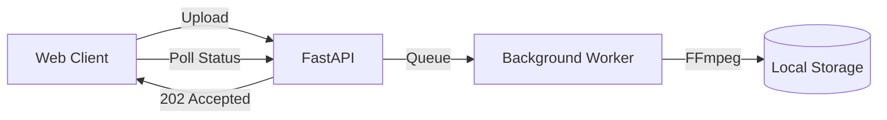

# Project 3: The Scalable Monolith

## 🚀 The Goal
Automate the transcoding pipeline. No more manual scripts; the system handles upload, encoding, and status tracking automatically.

## 😰 The Problem
In Project 2, we manually ran FFmpeg. In a real app, users upload videos whenever they want. If we run FFmpeg inside our web request, the browser will "Time Out" because transcoding takes minutes, but web requests should take milliseconds.

## 💡 The Solution: Asynchronous Processing
We decouple the "Response" from the "Work."



- **Background Tasks:** The API immediately returns a "202 Accepted" status.

## 😰 The Breaking Point
At **1,000+ users**, the monolith begins to crack:

```
At 50 concurrent uploads:
  └─► FFmpeg CPU usage: 92% (4-core VM)
  └─► API response time: 2.1s (target: < 200ms)
  └─► Memory usage: 3.2GB / 4GB (FFmpeg buffers)
  └─► TTFB for non-upload users: 1.8s (starved by FFmpeg)

At 200 concurrent uploads:
  └─► FFmpeg queue depth: 150+ (processing: 4, waiting: 146)
  └─► API returns 504 Gateway Timeout for 12% of requests
  └─► Average transcode wait time: 45 minutes
  └─► User abandonment: ~60% (no one waits 45min)
```

## ⚖️ Architecture Trade-offs
- **Pro:** Extreme simplicity. One `docker-compose.yml` for everything.
- **Con (CPU Contention):** Worker and API share the same CPU. FFmpeg at `-preset medium` uses 100% of available cores, starving the API.
- **Con (No Persistence):** If the server restarts, all in-progress encodes are lost. State is in local memory, not a persistent queue.
- **Con (No Horizontal Scale):** Can't add workers without duplicating the entire API.

---

## 🚀 How to Run
```bash
docker-compose up -d --build
```
👉 **Dashboard: http://localhost:8000**

[Back to Roadmap](../../README.md) | [Read the Theory](../../docs/principles-and-architecture.md#3-asynchronous-transcoding-project-3)
