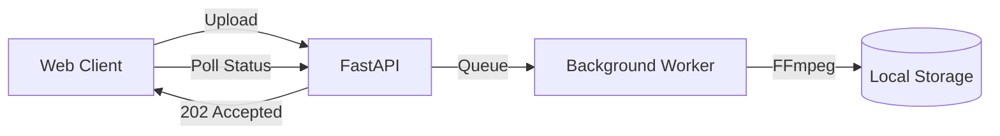

# Project 3: The Scalable Monolith

## 🚀 The Goal
Automate the transcoding pipeline. No more manual scripts; the system handles upload, encoding, and status tracking automatically.

## 😰 The Problem
In Project 2, we manually ran FFmpeg. In a real app, users upload videos whenever they want. If we run FFmpeg inside our web request, the browser will "Time Out" because transcoding takes minutes, but web requests should take milliseconds.

## 💡 The Solution: Asynchronous Processing
We decouple the "Response" from the "Work."



- **Background Tasks:** The API immediately returns a "202 Accepted" status.

## 😰 The Breaking Point
At **1,000+ users**, the monolith begins to crack:

```
At 50 concurrent uploads:
  └─► FFmpeg CPU usage: 92% (4-core VM)
  └─► API response time: 2.1s (target: < 200ms)
  └─► Memory usage: 3.2GB / 4GB (FFmpeg buffers)
  └─► TTFB for non-upload users: 1.8s (starved by FFmpeg)

At 200 concurrent uploads:
  └─► FFmpeg queue depth: 150+ (processing: 4, waiting: 146)
  └─► API returns 504 Gateway Timeout for 12% of requests
  └─► Average transcode wait time: 45 minutes
  └─► User abandonment: ~60% (no one waits 45min)
```

## ⚖️ Architecture Trade-offs
- **Pro:** Extreme simplicity. One `docker-compose.yml` for everything.
- **Con (CPU Contention):** Worker and API share the same CPU. FFmpeg at `-preset medium` uses 100% of available cores, starving the API.
- **Con (No Persistence):** If the server restarts, all in-progress encodes are lost. State is in local memory, not a persistent queue.
- **Con (No Horizontal Scale):** Can't add workers without duplicating the entire API.

---

## 🚀 How to Run
```bash
docker-compose up -d --build
```
👉 **Dashboard: http://localhost:8000**

---

## 📊 Phase Constraints

| Metric | This Phase | Previous (Manual) | Next Phase (Cloud) |
|---|---|---|---|
| Max concurrent uploads | 50 | 1 (manual CLI) | 500+ (distributed workers) |
| Transcode throughput | 4 videos/parallel | 1 at a time | 20+ (celery workers) |
| TTFB (non-upload requests) | 2.1s under load | 50ms (no load) | < 200ms (workers isolated) |
| Storage | Local disk (ephemeral) | Local disk | S3 (durable, infinite) |
| Monthly cost (1K users) | $50 | $50 | $200 |

## 🎬 Role in the Streaming Pipeline

```
THIS PROJECT:  [3. ASYNC TRANSCODE ENGINE]
                    │
Upload → ──► BACKGROUND WORKER (FFmpeg) ──► Segment → Manifest → CDN → Play
              ^^^^^^^^^^^^^^^^^^^^^^^^
              You are here.

This project solves: "How do we transcode WITHOUT blocking the API?"
Answer: Accept upload, return 202, queue FFmpeg in background.
Output: .ts segments + .m3u8 playlists (same as Project 2, but automated).
```

## 📈 Production Dashboard (What You'd Monitor)

| Metric | Healthy | Degraded | Critical |
|---|---|---|---|
| FFmpeg CPU usage | < 70% | 70-90% | > 90% (API starved) |
| Transcode queue depth | < 5 | 5-20 | > 50 (users waiting 30+ min) |
| API p95 latency | < 200ms | 200ms-1s | > 2s |
| Memory usage | < 60% | 60-80% | > 80% (OOM risk) |
| Upload success rate | > 99% | 95-99% | < 95% |

## 💰 Cost Impact at This Phase

```
COMPUTE (1 server, 4 cores):
  $50/month (handles ~50 concurrent uploads)
  CPU split: 80% FFmpeg, 20% API
  Problem: they compete for the SAME cores

WHEN TO MOVE TO NEXT PHASE:
  IF transcode_queue_depth > 20 regularly
  IF API_p95_latency > 1s
  IF upload abandonment > 10%
  → You need Project 5 (isolated workers in the cloud)
```

---

**Read Next:** [Project 4: Edge Caching & Signed URLs](../04-streaming-optimization/README.md) — Cache segments at the edge | [Cost Architecture](../../docs/cost-architecture.md#4-transcoding-cost-explosion) | [Back to Roadmap](../../README.md)
