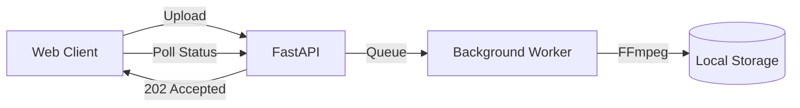

# Project 3: The Scalable Monolith

## 🚀 The Goal
Automate the transcoding pipeline. No more manual scripts; the system handles upload, encoding, and status tracking automatically.

## 😰 The Problem
In Project 2, we manually ran FFmpeg. In a real app, users upload videos whenever they want. If we run FFmpeg inside our web request, the browser will "Time Out" because transcoding takes minutes, but web requests should take milliseconds.

## 💡 The Solution: Asynchronous Processing
We decouple the "Response" from the "Work."



- **Background Tasks:** The API immediately returns a "202 Accepted" status.

## 😰 The Breaking Point
At **1,000+ users**, the worker and the API share the same CPU. If 50 users upload at once, the API becomes unresponsive (TTFB > 2s) because the CPU is 100% busy with FFmpeg.

## ⚖️ Architecture Trade-offs
- **Pro:** Extreme simplicity. One `docker-compose.yml` for everything.
- **Con (The Bottleneck):** No horizontal scaling. You can't add another worker without also adding another API server, which is wasteful.
- **Con (Reliability):** If the server restarts, all in-progress encodes are lost because state is stored in local memory, not a persistent queue.

---

## 🚀 How to Run
```bash
docker-compose up -d --build
```
👉 **Dashboard: http://localhost:8000**

[Back to Roadmap](../../README.md) | [Read the Theory](../../docs/principles-and-architecture.md#3-asynchronous-transcoding-project-3)
