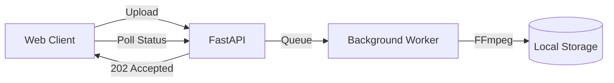

# Project 3: The Scalable Monolith

## 🚀 The Goal
Automate the transcoding pipeline. No more manual scripts; the system handles upload, encoding, and status tracking automatically.

## 😰 The Problem
In Project 2, we manually ran FFmpeg. In a real app, users upload videos whenever they want. If we run FFmpeg inside our web request, the browser will "Time Out" because transcoding takes minutes, but web requests should take milliseconds.

## 💡 The Solution: Asynchronous Processing
We decouple the "Response" from the "Work."



- **Background Tasks:** The API immediately returns a "202 Accepted" status.

## 🛠️ Implementation Idea
- **The State Machine:** Every video has a status (`UPLOADED` -> `PROCESSING` -> `READY`).
- **The Dashboard:** A state-aware UI that updates the status without refreshing the entire page.

## 🎓 Key Takeaway
**Never do heavy lifting in the web thread.** Offload "Hot Tasks" to background workers to keep your application responsive and professional.

---

## 🚀 How to Run
```bash
docker-compose up -d --build
```
👉 **Dashboard: http://localhost:8000**

[Back to Roadmap](../../README.md) | [Read the Theory](../../docs/principles-and-architecture.md#3-asynchronous-transcoding-project-3)
