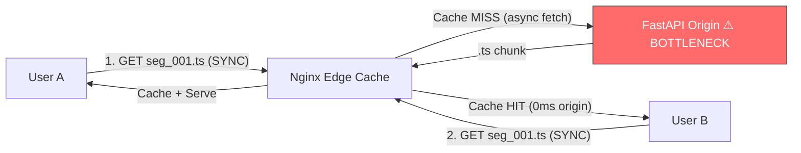

# Project 4: Edge Caching & Signed URLs

## 🚀 The Goal
Secure your content and optimize delivery for 10,000+ concurrent viewers.

## 😰 The Problem
1. **The Thundering Herd:** If 10,000 people watch the same viral video, your backend will crash trying to serve the same file repeatedly.
2. **The Security Gap:** Without security, anyone can copy your video link and embed it on their own site, stealing your bandwidth.

## 💡 The Solution: Edge Caching & Signed URLs
We implement a high-performance caching layer to prevent "Backend Meltdown."



- **Edge Caching (Nginx):** Fetches once, serves millions. `proxy_cache_lock` ensures only 1 origin request per segment.
- **HMAC Signed URLs:** Cryptographic tokens ensure only authorized users can trigger a "Fetch."

### CDN vs Origin Cost Math

```
WITHOUT edge cache (100K viewers, 720p, 1 hour):
  └─► 100K × 1.26 GB/hr = 126 TB egress from origin
  └─► Origin cost: 126,000 GB × $0.09/GB = $11,340/hour ← BANKRUPT

WITH edge cache (95% hit rate):
  └─► Origin serves: 5% × 100K = 5,000 unique fetches
  └─► Origin cost: 5,000 × 1.26 GB × $0.09 = $567
  └─► CDN cost: 126,000 GB × $0.02/GB = $2,520
  └─► Total: $3,087/hour
  └─► SAVINGS: 73% ($8,253/hour saved)
```

## 😰 The Breaking Point
At **100,000+ users**, "Origin Caching" inside Nginx still puts a heavy load on your single server's disk and network interface. If 50,000 people from Japan try to watch a video stored in a US-East server, the network latency (~200ms) will make the player feel sluggish, even if it's "cached."

## ⚖️ Architecture Trade-offs
- **Pro:** Massive Offload. Nginx handles 99% of the traffic, keeping the FastAPI origin quiet and safe.
- **Con (The Purge Problem):** If you update a video, but the edge has it cached for 1 hour, your users will see old content. Managing **Cache Invalidation** globally is one of the hardest problems in systems engineering.
- **Con (Token Revocation):** Signed URLs are great, but if a token is stolen, it's valid until it expires. Revoking a single token across a global CDN is complex and expensive.

---

## 🚀 How to Run
```bash
docker-compose up -d --build
```
👉 **Dashboard: http://localhost:8084**

[Back to Roadmap](../../README.md) | [Read the Theory](../../docs/principles-and-architecture.md#4-edge-caching--security-project-4)
