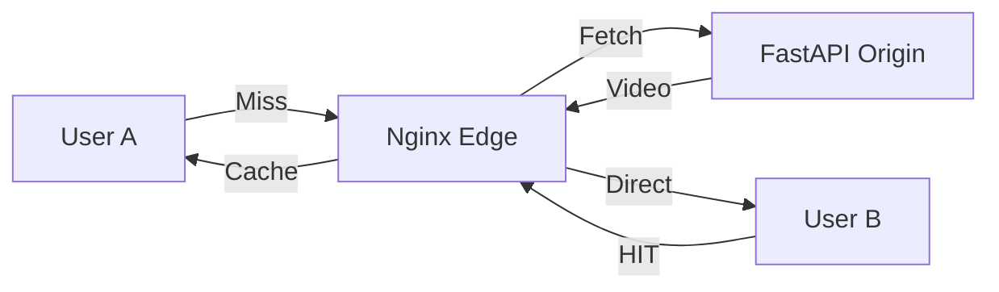

# Project 4: Edge Caching & Signed URLs

## 🚀 The Goal
Secure your content and optimize delivery for 10,000+ concurrent viewers.

## 😰 The Problem
1. **The Thundering Herd:** If 10,000 people watch the same viral video, your backend will crash trying to serve the same file repeatedly.
2. **The Security Gap:** Without security, anyone can copy your video link and embed it on their own site, stealing your bandwidth.

## 💡 The Solution: Edge Caching & Signed URLs
We implement a high-performance caching layer to prevent "Backend Meltdown."



- **Edge Caching (Nginx):** Fetches once, serves millions.
- **HMAC Signed URLs:** Cryptographic tokens ensure only authorized users can trigger a "Fetch."

## 🛠️ Implementation Idea
- **Proxy Cache:** Configuring Nginx `proxy_cache_path` to handle `.ts` and `.m3u8` files differently.
- **HMAC Verification:** A small Python middleware that validates the `token` and `expires` timestamp.

## 🎓 Key Takeaway
**Cache at the Edge, Secure at the Origin.** Caching saves money; Signed URLs protect your business model.

---

## 🚀 How to Run
```bash
docker-compose up -d --build
```
👉 **Dashboard: http://localhost:8084**

[Back to Roadmap](../../README.md) | [Read the Theory](../../docs/principles-and-architecture.md#4-edge-caching--security-project-4)
