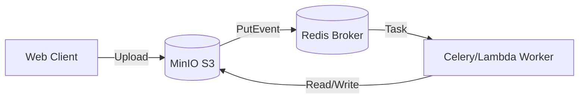

# Project 5: Cloud-Native Emulator

## 🚀 The Goal
Build a distributed, decoupled video pipeline using industry-standard architectural patterns.

## 😰 The Problem
In Project 3, we used a local disk. In a real cloud environment (AWS/Google Cloud), local disks are "Ephemeral"—they get deleted when the server restarts. To scale globally, we need storage that lives outside our servers.

## 💡 The Solution: Object Storage & Task Queues
We replace local paths with the **S3 Architecture**, simulating a high-scale environment where storage, compute, and messaging are decoupled.



### 🧠 Systems Thinking: Scaling Object Storage
In a real production environment (AWS S3), scaling isn't just about disk space; it's about **IOPS Partitioning**. 
- **The Secret:** S3 scales throughput based on your **Object Key Prefix**.
- **The Hack:** By hashing your file names (e.g., `af/12/video.mp4`), you distribute the load across multiple S3 partitions, avoiding "Hot Index" issues.

## 😰 The Breaking Point
At **100,000+ users**, "Local Disk" storage becomes a liability. If the server crashes, the disk is wiped (ephemeral storage). If you scale to 5 servers, they can't "share" a single local folder easily.

## ⚖️ Architecture Trade-offs
- **Pro:** Infinite Scale. S3 storage is virtually bottomless and highly durable (99.999999999%).
- **Con (Complexity):** You can no longer use simple `open('file.mp4')`. You must handle **S3 Latency** and asynchronous upload callbacks.
- **Con (Consistency):** S3 is "Eventually Consistent." If you upload a video and immediately try to read it, you might get a `404` for a few milliseconds while the data propagates.

## 🎓 Key Takeaway
**Decouple your compute from your storage.** By using S3 and Queues, your system becomes "Stateless," meaning you can destroy and recreate your servers without losing a single video.

---

## 🚀 How to Run
```bash
docker-compose up -d --build
```
👉 **Cloud Console: http://localhost:8005**

[Back to Roadmap](../../README.md) | [Read the Theory](../../docs/principles-and-architecture.md#5-distributed-storage-project-5)
