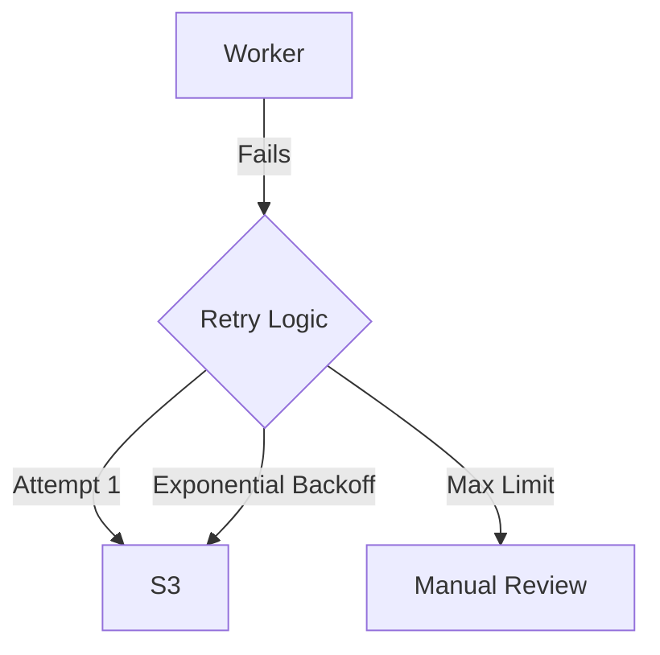

# Project 6: Chaos & Resilience

## 🚀 The Goal
Ensure your streaming platform survives even when the network is failing.

## 😰 The Problem
In the real world, "Cloud services" have hiccups. Connections fail, S3 lags, and servers crash. If your code assumes "Everything is fine," it will crash and burn the moment a small lag occurs.

## 💡 The Solution: Resilience Patterns
We implement patterns that allow the system to "Heal" while under attack from **Pumba (Chaos Monkey)**.



### 🧠 Systems Thinking: Idempotency & Circuit Breakers
- **Idempotency:** In a distributed system, a task might run twice. We use **Atomic Operations** to ensure that `ProcessVideo(ID: 123)` always produces exactly one output, even if triggered 100 times.
- **Circuit Breaker:** If S3 is down, retrying 1,000 times as fast as possible will only Ddos your own network. We implement a "Break" to stop requests until the system is healthy again.

## 🛠️ Implementation Idea
**The Retry Pattern:**
Using decorators (`@retry`) to wrap S3 operations. Instead of failing immediately, the worker waits 2s, then 4s, then 8s until the "Lag" clears.

## 🎓 Key Takeaway
**Expect Failure.** A resilient system isn't one that never crashes; it's one that recovers so fast the user never notices the glitch.

---

## 🚀 How to Run
```bash
docker-compose up -d --build
```
👉 **Chaos Lab: http://localhost:8006**

[Back to Roadmap](../../README.md) | [Read the Theory](../../docs/principles-and-architecture.md#6-chaos-engineering-project-6)
