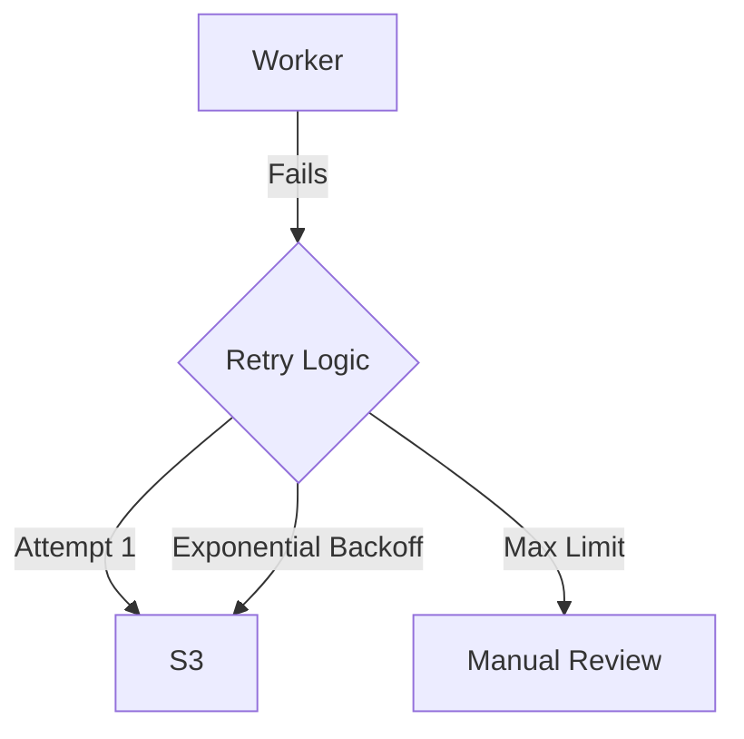

# Project 6: Chaos & Resilience

## 🚀 The Goal
Ensure your streaming platform survives even when the network is failing.

## 😰 The Problem
In the real world, "Cloud services" have hiccups. Connections fail, S3 lags, and servers crash. If your code assumes "Everything is fine," it will crash and burn the moment a small lag occurs.

## 💡 The Solution: Resilience Patterns
We implement patterns that allow the system to "Heal" while under attack from **Pumba (Chaos Monkey)**.



## 😰 The Breaking Point
At **100,000+ users**, the "Retry Storm" becomes your biggest enemy. If a small network glitch causes 100,000 users to "Retry" their requests at the exact same millisecond, it acts like a self-inflicted Ddos attack, crashing your database or storage.

## ⚖️ Architecture Trade-offs
- **Pro:** Extreme Uptime. Even if a worker crashes, the video eventually gets processed.
- **Con (The Complexity Tax):** You can no longer use simple `INSERT` statements. You must write **Idempotent** code (logic that can run 10 times without breaking things), which is significantly harder to debug.
- **Con (Eventual Consistency):** A user might upload a video and see "Processing" for 3 extra seconds while the retry-loop finishes, sacrificing "Instant Gratification" for "System Safety."

## 🛠️ Implementation Idea
**The Retry Pattern:**
Using decorators (`@retry`) to wrap S3 operations. Instead of failing immediately, the worker waits 2s, then 4s, then 8s until the "Lag" clears.

---

## 📊 Phase Constraints

| Metric | Without Resilience | With Resilience |
|---|---|---|
| Transcode failure rate | 3-5% (S3 timeouts kill jobs) | < 0.1% (retries recover 99%+) |
| Video loss per 1K uploads | 30-50 videos | < 1 video |
| Recovery from S3 outage (5 min) | Manual restart of all failed jobs | Automatic recovery in < 2 minutes |
| Duplicate transcodes | Common (manual re-runs) | 0 (idempotent worker design) |
| MTTR (Mean Time to Recovery) | 30 min (engineer intervention) | 2 min (automatic retry + DLQ) |

## 🎬 Role in the Streaming Pipeline

```
THIS PROJECT:  [6. RESILIENCE LAYER]
                    │
Upload → Queue → ──► WORKER WITH RETRY + CIRCUIT BREAKER ──► .ts segments → CDN → Play
                     ^^^^^^^^^^^^^^^^^^^^^^^^^^^^^^^^^^^
                     You are here.

This project protects the pipeline:
  IF S3 is slow → retry with backoff (don't lose the video)
  IF S3 is down → circuit breaker opens (don't DDoS yourself)
  IF worker crashes → queue redelivers (at-least-once semantics)
  IF duplicate job → idempotent check (IF EXISTS output → SKIP)
```

## 📈 Production Dashboard (What You'd Monitor)

| Metric | Healthy | Warning | Critical |
|---|---|---|---|
| Retry rate (retries/min) | < 5 | 5-20 | > 50 (underlying service degraded) |
| Circuit breaker state | CLOSED | HALF-OPEN (probing) | OPEN (S3 down, all jobs paused) |
| DLQ depth | 0 | 1-5 | > 10 (systematic failure, page on-call) |
| Worker success rate | > 99.5% | 95-99% | < 95% |
| Duplicate job rejections | < 1/hr | 1-10/hr | > 50/hr (queue double-delivery issue) |

## 💰 Cost Impact

```
RESILIENCE OVERHEAD:
  Compute: ~5% more CPU (retry logic, health checks)
  Latency: +2-8 seconds per failed operation (backoff wait)
  Storage: DLQ table in Redis (~negligible)

COST OF NOT HAVING RESILIENCE:
  At 10K uploads/day with 3% failure rate:
  └─► 300 failed videos/day × manual re-trigger time
  └─► Engineer cost: 2 hours/day × $80/hour = $160/day
  └─► User churn from "my video disappeared": PRICELESS
```

---

## 🚀 How to Run
```bash
docker-compose up -d --build
```
👉 **Chaos Lab: http://localhost:8006**

**Read Next:** [Project 7: Live Streaming](../07-live-streaming/README.md) — Real-time .ts generation | [Failure Modeling Guide](../../docs/failure-modeling.md) | [Back to Roadmap](../../README.md)
