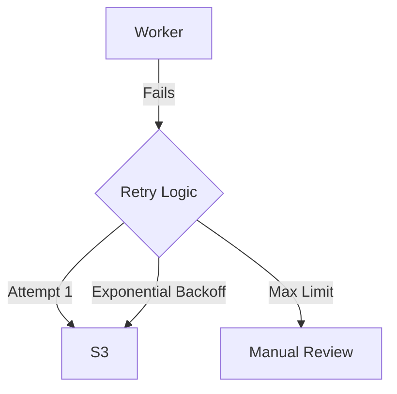

# Project 6: Chaos & Resilience

## 🚀 The Goal
Ensure your streaming platform survives even when the network is failing.

## 😰 The Problem
In the real world, "Cloud services" have hiccups. Connections fail, S3 lags, and servers crash. If your code assumes "Everything is fine," it will crash and burn the moment a small lag occurs.

## 💡 The Solution: Resilience Patterns
We implement patterns that allow the system to "Heal" while under attack from **Pumba (Chaos Monkey)**.



## 😰 The Breaking Point
At **100,000+ users**, the "Retry Storm" becomes your biggest enemy. If a small network glitch causes 100,000 users to "Retry" their requests at the exact same millisecond, it acts like a self-inflicted Ddos attack, crashing your database or storage.

## ⚖️ Architecture Trade-offs
- **Pro:** Extreme Uptime. Even if a worker crashes, the video eventually gets processed.
- **Con (The Complexity Tax):** You can no longer use simple `INSERT` statements. You must write **Idempotent** code (logic that can run 10 times without breaking things), which is significantly harder to debug.
- **Con (Eventual Consistency):** A user might upload a video and see "Processing" for 3 extra seconds while the retry-loop finishes, sacrificing "Instant Gratification" for "System Safety."

## 🛠️ Implementation Idea
**The Retry Pattern:**
Using decorators (`@retry`) to wrap S3 operations. Instead of failing immediately, the worker waits 2s, then 4s, then 8s until the "Lag" clears.

## 🎓 Key Takeaway
**Expect Failure.** A resilient system isn't one that never crashes; it's one that recovers so fast the user never notices the glitch.

---

## 🚀 How to Run
```bash
docker-compose up -d --build
```
👉 **Chaos Lab: http://localhost:8006**

[Back to Roadmap](../../README.md) | [Read the Theory](../../docs/principles-and-architecture.md#6-chaos-engineering-project-6)
