# Project 7: Real-Time Live Streaming

## 🚀 The Goal
Build a professional-grade "Live Studio" that can ingest a camera feed and broadcast it globally.

## 😰 The Problem
VOD (Video on Demand) is easy because the files already exist. In **Live**, every millisecond matters. We can't wait for a whole file to be encoded; we have to "stream" the stream.

## 💡 The Solution: RTMP-to-HLS Repackaging
We use a high-performance **Nginx-RTMP** module to handle the heavy lifting of real-time stream conversion.

```mermaid
graph LR
    OBS[Broadcaster/OBS] -->|"RTMP Push (SYNC, persistent)"| Ingest["Nginx RTMP ⚠️ CPU BOTTLENECK"]
    Ingest -->|"Real-time Transcode"| HLS["FFmpeg → .ts + .m3u8"]
    HLS -->|"6s segments written to disk"| Disk[/tmp/hls/stream/]
    Disk -->|"Nginx Static Serve (SYNC)"| CDN[Edge Cache]
    CDN -->|"HLS Pull (SYNC)"| Player[HLS.js Player]
    Player -->|"ABR Switch"| Player
    
    style Ingest fill:#ff6b6b,stroke:#333,color:#fff
```



### Live Segment Lifecycle (Real-time .ts Generation)

```
t=0.000s  Camera captures frame → OBS encodes → RTMP packet sent
t=0.050s  Nginx-RTMP receives packet, buffers in memory
t=6.000s  6 seconds accumulated → FFmpeg writes segment_047.ts (2.2MB)
t=6.001s  FFmpeg updates live.m3u8 playlist:
            #EXTINF:6.0,
            segment_045.ts    ← 2 segments ago (can be purged)
            segment_046.ts    ← previous
            segment_047.ts    ← CURRENT (just created)
t=6.050s  CDN fetches new .m3u8 (detects new segment)
t=6.100s  Player downloads segment_047.ts
t=6.300s  Player decodes + renders → USER SEES THE FRAME

Total glass-to-glass latency: ~6.3 seconds (3 segments × 2s + network)
```

### Live Streaming Cost at Scale

| Concurrent Viewers | Segments/sec | CDN RPS | Bandwidth | CDN Cost/hour |
|---|---|---|---|---|
| 1,000 | 167/s | 10K/min | 2.8 Gbps | $0.50 |
| 100,000 | 16,700/s | 1M/min | 280 Gbps | $50 |
| 1,000,000 | 167,000/s | 10M/min | 2.8 Tbps | $500 |

### 🧠 Systems Thinking: The Latency vs. Load Trade-off
- **The Dilemma:** To get "Ultra-Low Latency" in HLS, you must reduce the segment size (e.g., from 10s to 1s).
- **The Consequence:** A 1s segment size means the player requests a new file **every second**. If you have 1 million users, your CDN will be hit with **1 million requests per second**, potentially crashing your infrastructure. This is why "Live" is the hardest part of streaming.

## 😰 The Breaking Point
At **1,000 concurrent broadcasters**, the Nginx CPU becomes a massive bottleneck. Every "RTMP Push" requires a real-time process to spawn. If the server is doing 1,000 conversions at once, the "Live Delay" will spike from 3s to 60s, making the stream "Not Live" anymore.

## ⚖️ Architecture Trade-offs
- **Pro:** Low Latency (HLS). By using 2s segments, we get an elite live experience.
- **Con (The CDN Storm):** 2s segments mean every user fetches a file every 2 seconds. A single viral stream with 10M viewers will generate **5 Million Requests Per Second**, which can overwhelm even global CDNs.
- **Con (Ingest Complexity):** RTMP is an older protocol; it doesn't support modern codecs like AV1 naturally, limiting our future quality upgrades.

## 🎓 Key Takeaway
**Ingest with RTMP, Distribute with HLS.** RTMP is the industry standard for "pushing" the news; HLS is the standard for "viewing" it.

---

## 🚀 How to Run
```bash
docker-compose up -d --build
```
👉 **Live Studio: http://localhost:8087**

### To Start the Stream:
```bash
ffmpeg -re -i /home/thearp/projects/videostreaming/samples/sample1.mp4 -vcodec libx264 -acodec aac -f flv rtmp://localhost:1935/live/stream1
```

**Read Next:** [Project 8: DRM & Content Protection](../08-drm-protection/README.md) — Encrypt .ts segments | [Streaming Internals: Live vs VOD](../../docs/streaming-internals.md#5-live-vs-vod-streaming) | [Back to Roadmap](../../README.md)
