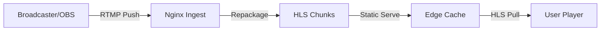

# Project 7: Real-Time Live Streaming

## 🚀 The Goal
Build a professional-grade "Live Studio" that can ingest a camera feed and broadcast it globally.

## 😰 The Problem
VOD (Video on Demand) is easy because the files already exist. In **Live**, every millisecond matters. We can't wait for a whole file to be encoded; we have to "stream" the stream.

## 💡 The Solution: RTMP-to-HLS Repackaging
We use a high-performance **Nginx-RTMP** module to handle the heavy lifting of real-time stream conversion.



### 🧠 Systems Thinking: The Latency vs. Load Trade-off
- **The Dilemma:** To get "Ultra-Low Latency" in HLS, you must reduce the segment size (e.g., from 10s to 1s).
- **The Consequence:** A 1s segment size means the player requests a new file **every second**. If you have 1 million users, your CDN will be hit with **1 million requests per second**, potentially crashing your infrastructure. This is why "Live" is the hardest part of streaming.

## 🛠️ Implementation Idea
**Low-Latency HLS Tuning:**
We configure Nginx to use 3-second segments instead of the standard 10-second ones. This reduces the "Broadcast Delay" from 30 seconds down to under 10 seconds.

## 🎓 Key Takeaway
**Ingest with RTMP, Distribute with HLS.** RTMP is the industry standard for "pushing" the news; HLS is the standard for "viewing" it.

---

## 🚀 How to Run
```bash
docker-compose up -d --build
```
👉 **Live Studio: http://localhost:8087**

### To Start the Stream:
```bash
ffmpeg -re -i /home/thearp/projects/videostreaming/samples/sample1.mp4 -vcodec libx264 -acodec aac -f flv rtmp://localhost:1935/live/stream1
```

[Back to Roadmap](../../README.md) | [Read the Theory](../../docs/principles-and-architecture.md#7-rtmp-ingestion-project-7)
