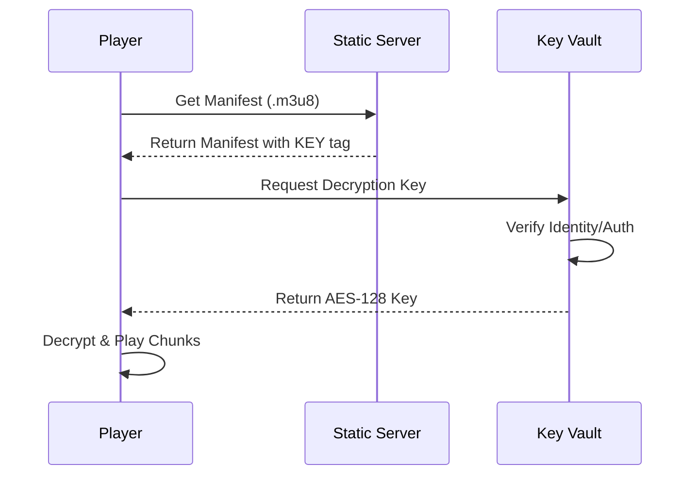

# Project 8: DRM & Content Protection (AES-128 ClearKey)

## 🚀 The Goal
Protect your premium video content from being played or downloaded by unauthorized users.

## 😰 The Problem
In Project 4, we used "Signed URLs." This protected the *link*, but what if a user downloads the video chips (`.ts` files)? They can still watch them offline or share the raw files. 

## 💡 The Solution: En-Route Encryption
We use **AES-128 Encryption** and a simulated **ClearKey License Server**.



### 🧠 Systems Thinking: Security at the Bit-Level
- **The Philosophy:** Never trust the client. Even if a user downloads the entire library, they have nothing but "Digital Noise" unless our Vault grants them a 16-byte key.

### Encryption Overhead

| Metric | Without DRM | With AES-128 DRM |
|---|---|---|
| Segment size (6s, 720p) | 2.1 MB | 2.1 MB (same — AES is block-level) |
| Transcode time (per video) | 8 min | 8 min + 2s (key generation) |
| Playback startup time | 1.2s | 1.8s (+600ms key fetch) |
| Key requests per viewer/hour | 0 | 1 (single key, cached by player) |
| Key server load (100K viewers) | 0 RPS | ~28 RPS (keys cached for 1 hour) |

### Key Rotation Strategy

```
Standard (VOD): Single key per video. Never rotates.
  └─► Simplest. Key cached by player for entire session.

Enhanced (Live): Key rotates every 60 seconds.
  └─► Limits exposure if key is leaked.
  └─► Key server load: 100K viewers × 1 req/min = 1,667 RPS

Premium (Live + Anti-Piracy): Key rotates every segment (6s).
  └─► Maximum security. Key leak affects only 6 seconds of content.
  └─► Key server load: 100K × 10 req/min = 16,667 RPS ← EXPENSIVE
```

## 😰 The Breaking Point
At **100,000+ concurrent DRM viewers**, the Key Vault becomes a critical bottleneck:
- Key fetch adds **600ms** to initial playback (users perceive "slow loading")
- If Key Vault goes down: **100% of DRM playback fails** (total blackout)
- Mitigation: Edge-cache keys with 5-minute TTL (see [Failure Modeling](../../docs/failure-modeling.md#f6-drm-key-server-down))

## ⚖️ Architecture Trade-offs
- **Pro:** Content is mathematically unplayable without the key. Even raw `.ts` downloads are useless.
- **Con (Startup Latency):** Every new viewer must make an extra HTTP roundtrip to the Key Vault before first frame.
- **Con (Single Point of Failure):** The Key Vault is the only component whose failure causes a **total** outage for all DRM content.

---

## 🚀 How to Run
```bash
docker-compose up -d --build
```
👉 **Secure Player: http://localhost:8088**

[Back to Roadmap](../../README.md) | [Read the Theory](../../docs/principles-and-architecture.md#phase-4-real-time--security)
