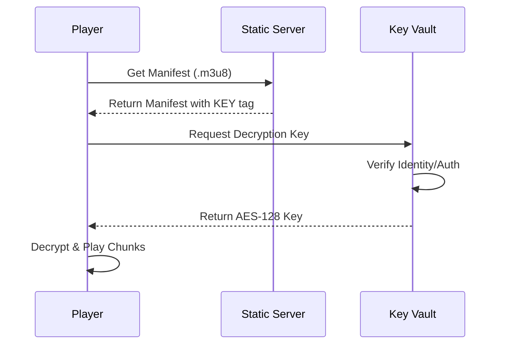

# Project 8: DRM & Content Protection (AES-128 ClearKey)

## 🚀 The Goal
Protect your premium video content from being played or downloaded by unauthorized users.

## 😰 The Problem
In Project 4, we used "Signed URLs." This protected the *link*, but what if a user downloads the video chips (`.ts` files)? They can still watch them offline or share the raw files. 

## 💡 The Solution: En-Route Encryption
We use **AES-128 Encryption** and a simulated **ClearKey License Server**.



### 🧠 Systems Thinking: Security at the Bit-Level
- **The Philosophy:** Never trust the client. By encrypting the actual video bits, we ensure that even if a user downloads the entire library, they have nothing but "Digital Noise" unless our Vault grants them a 16-byte key.

## 🛠️ Implementation Idea
- **FFmpeg Encryption:** Using `-hls_key_info_file` to tell FFmpeg how to encrypt the segments.
- **The Key Vault:** A secure FastAPI endpoint that behaves like a basic **DRM License Server**.

## 🎓 Key Takeaway
**Encryption is the only true protection.** If the files are encrypted, the "bits" are useless without the "key."

---

## 🚀 How to Run
```bash
docker-compose up -d --build
```
👉 **Secure Player: http://localhost:8088**

[Back to Roadmap](../../README.md) | [Read the Theory](../../docs/principles-and-architecture.md#phase-4-real-time--security)
