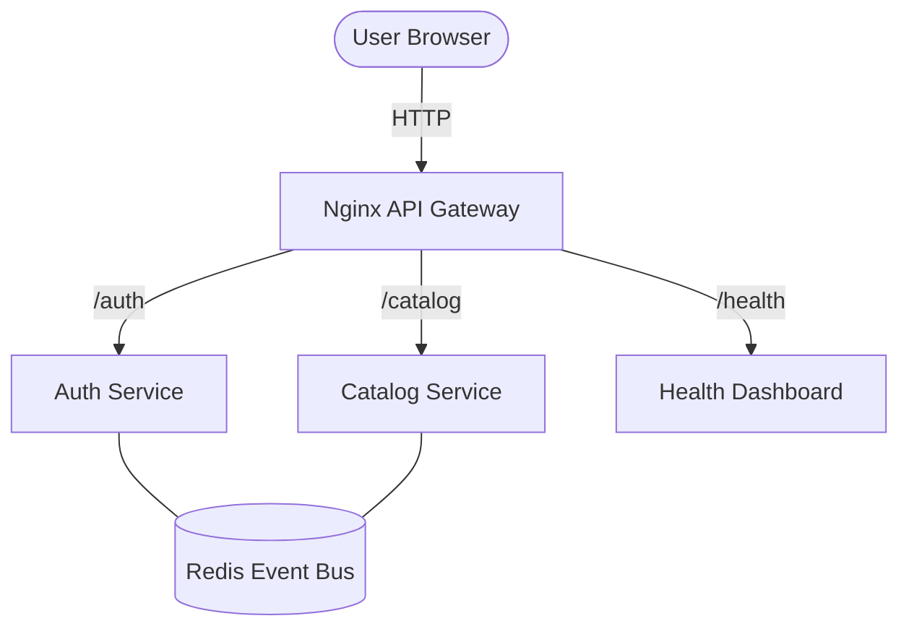

# Project 10: Microservices Migration

## 🚀 The Goal
Transition from a "Distributed Monolith" to a truly decoupled **Microservices Ecosystem**.

## 😰 The Breaking Point
At **10M+ users**, the "Scalable Monolith" from Phase 2/3 begins to crack. While we have background workers, the **Deployment Velocity** slows down. Every time we want to update the "Auth" logic, we have to restart the "Transcoder" and "Catalog" logic because they are in the same code binary.

## 💡 The Solution: Service Isolation
We break the system into small, specialized apps (Auth, Catalog) that communicate over the network.

## ⚖️ Architecture Trade-offs
Moving to Microservices isn't "better"—it's a choice with heavy costs:
- **Pro:** Team A can update the Auth service without touching Team B's Catalog service.
- **Con (Network Latency):** A single user request now involves 3+ network hops (Gateway -> Auth -> DB).
- **Con (Observability):** Debugging a "500 Internal Server Error" now requires **Distributed Tracing** because the error could be in any of the 4 isolated containers.



- **Gateway:** Route traffic based on URLs (e.g., `/auth` -> Auth Service).
- **Auth Service:** Responsible for only one thing: Identity.
- **Catalog Service:** Responsible for only one thing: Data.
- **Independence:** If the Auth service is undergoing maintenance, users can still browse the Catalog.

## 🛠️ Implementation Idea
- **Reverse Proxy (Nginx):** Acts as the single entry point.
- **Shared Event Bus (Redis):** Services talk to each other through messages, not direct calls (Async Decoupling).
- **Service Status Dashboard:** A central UI to monitor the "Pulse" of the entire cluster.

## 🎓 Key Takeaway
**Microservices is an organizational pattern as much as a technical one.** It allows teams to move fast, fail small, and scale independently.

---

## 🚀 How to Run
```bash
docker-compose up -d --build
```
👉 **System Dashboard: http://localhost:8010**

---

## 🧪 The Resilience Test (Chaos Simulation)
To truly understand the power of microservices, you must see the system survive a partial failure.

### 1. Kill the Catalog Service
Run this while the dashboard is open:
```bash
docker-compose stop catalog-service
```
**Observation:** The dashboard will show the Catalog Service turn **RED (UNREACHABLE)**, but the **Auth Service** stays **GREEN**. You can still log in! In a monolith, the whole site would be down.

### 2. Heal the System
Bring it back to life:
```bash
docker-compose start catalog-service
```
**Observation:** Within 3 seconds, the dashboard will detect the "Heartbeat" again and turn Green.

---

[Back to Roadmap](../../README.md) | [Read the Theory](../../docs/principles-and-architecture.md)
